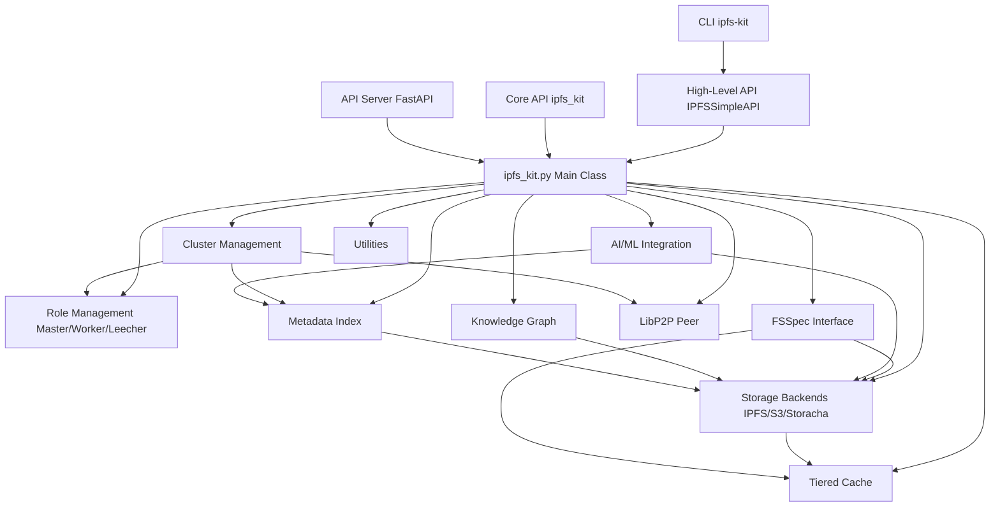

# IPFS Kit

IPFS Kit is a comprehensive Python toolkit for working with IPFS (InterPlanetary File System) technologies. It provides a unified interface for IPFS operations, cluster management, tiered storage, and AI/ML integration.

This library installs and configures IPFS services through Kubo and IPFS Cluster based on the contents in the config file. It supports different node roles (master, worker, or leecher) and allows IPFS content to be accessed through multiple backends, including local IPFS node, IPFS Cluster, Storacha (previously Web3.Storage), and S3-compatible storage.

## Architecture Overview

IPFS Kit is designed with a modular architecture:



-   **User Interfaces**: Provides multiple ways to interact with the kit (CLI, High-Level API, Core API, REST API Server).
-   **Core `ipfs_kit` Class**: The central orchestrator, managing configuration and initializing role-specific components.
-   **Role Management**: Handles the distinct behaviors and component loading for Master, Worker, and Leecher roles, including dynamic role switching.
-   **Cluster Management**: Advanced features for coordinating multiple nodes, including task distribution, state synchronization, monitoring, and authentication.
-   **Storage Backends**: Abstracts interactions with various storage systems (local IPFS, IPFS Cluster, S3, Storacha).
-   **FSSpec Interface**: Offers a standard Python filesystem interface for seamless data access.
-   **Tiered Cache**: Optimizes data retrieval speed using memory, disk, and memory-mapped caching.
-   **Metadata Index**: Enables efficient searching and discovery of content using Apache Arrow.
-   **LibP2P Peer**: Facilitates direct peer-to-peer communication and content exchange.
-   **AI/ML Integration**: Tools for managing ML models/datasets and integrating with frameworks like PyTorch/TensorFlow.
-   **Knowledge Graph**: Represents relationships between IPFS objects using IPLD.
-   **Utilities**: Common functions for error handling, validation, etc.

## Features

-   **High-Level API**: Simplified interface (`IPFSSimpleAPI`) with declarative configuration (YAML/JSON), automatic error handling, and a plugin architecture for easy extension. ([See Docs](docs/high_level_api.md))
-   **Role-based Architecture**: Configure nodes as master, worker, or leecher, each optimized for specific tasks (coordination, computation, consumption). ([See Docs](docs/core_concepts.md))
-   **Tiered Storage & Caching**: Intelligently manage content across multiple storage backends (IPFS, Cluster, S3, Storacha) with a high-performance Adaptive Replacement Cache (ARC) system featuring memory, disk, and memory-mapped tiers. ([See Docs](docs/tiered_cache.md))
-   **Standard Filesystem Interface**: Use the FSSpec integration (`IPFSFileSystem`) for familiar filesystem-like access to IPFS content, enabling seamless use with data science tools like Pandas and Dask. Features proper inheritance from AbstractFileSystem with graceful fallbacks and comprehensive error handling. ([See Docs](docs/fsspec_integration.md))
-   **Metadata Indexing**: Efficient Arrow-based metadata index with distributed synchronization (via IPFS PubSub and DAGs) for fast content discovery, querying, and multi-location tracking. ([See Docs](docs/metadata_index.md))
-   **Direct P2P Communication**: Establish direct peer connections using libp2p for daemon-less content exchange, featuring advanced DHT discovery, provider reputation, and NAT traversal. ([See Docs](docs/libp2p_integration.md))
-   **Advanced Cluster Management**: Sophisticated cluster coordination including leader election, task distribution, state synchronization (CRDTs, vector clocks), health monitoring, secure authentication (TLS, UCANs), and dynamic role adaptation based on resource availability. ([See Docs](docs/cluster_management.md))
-   **Storacha/S3 Integration**: Access content via Storacha (Web3.Storage) and S3-compatible storage as alternative backends. ([See Docs](docs/storage_backends.md))
-   **Comprehensive Error Handling**: Standardized error classes and detailed result dictionaries for robust application development.
-   **High Performance**: Optimized for speed with features like memory-mapped file access and low-latency Unix socket communication (2-3x faster than HTTP for local daemon).
-   **Arrow-Based Cluster State**: Efficient, zero-copy cluster state sharing across processes using Apache Arrow, enabling interoperability with C++, Rust, etc. ([See Docs](docs/cluster_state_helpers.md))
-   **Distributed Task Management**: Define, submit, and track computational tasks across a cluster of worker nodes.
-   **AI/ML Integration**: Includes tools like `IPFSDataLoader` for efficient batch loading from IPFS into PyTorch/TensorFlow, plus a Model Registry and Dataset Manager for versioned, content-addressed ML assets. ([See Docs](docs/ai_ml.md), [IPFS DataLoader](docs/ipfs_dataloader.md))
-   **IPLD Knowledge Graph**: Model relationships between IPFS objects using IPLD for advanced data representation. ([See Docs](docs/knowledge_graph.md))
-   **SDK Generation**: Automatically generate client SDKs for Python, JavaScript, and Rust.

## Installation

### From PyPI (Recommended)

You can install IPFS Kit directly from PyPI with optional dependency groups:

```bash
# Basic installation with core functionality
pip install ipfs_kit_py

# With filesystem support (fsspec integration)
pip install ipfs_kit_py[fsspec]

# With Arrow integration for high-performance data operations
pip install ipfs_kit_py[arrow]

# With AI/ML support for model and dataset management
pip install ipfs_kit_py[ai_ml]

# With API server support (FastAPI-based HTTP server)
pip install ipfs_kit_py[api]

# Development installation with testing tools
pip install ipfs_kit_py[dev]

# Full installation with all dependencies
pip install ipfs_kit_py[full]
```

### From Source

For the latest development version or to contribute:

```bash
# Clone the repository
git clone https://github.com/endomorphosis/ipfs_kit_py
cd ipfs_kit_py

# Install in development mode with selected extras
pip install -e ".[fsspec,arrow]"

# Or install all dependencies for development
pip install -e ".[full,dev]"
```

### Docker Installation

For containerized deployment:

```bash
# Build the Docker image
docker build -t ipfs-kit-py .

# Run in master mode
docker run -d --name ipfs-master -p 5001:5001 -p 8080:8080 -v ipfs-data:/data ipfs-kit-py master

# Run in worker mode connected to master
docker run -d --name ipfs-worker --link ipfs-master -v ipfs-worker-data:/data ipfs-kit-py worker --master=ipfs-master:9096

# Run in leecher mode
docker run -d --name ipfs-leecher -p 5002:5001 -p 8081:8080 -v ipfs-leecher-data:/data ipfs-kit-py leecher
```

## Command-line Interface

IPFS Kit includes a comprehensive command-line interface for accessing all core functionality:

```bash
# Basic usage
ipfs-kit add example.txt              # Add a file to IPFS
ipfs-kit get QmCID                    # Get content from IPFS
ipfs-kit ls QmCID                     # List directory contents
ipfs-kit pin QmCID                    # Pin content to local node

# Core IPFS operations
ipfs-kit add --pin --wrap-with-directory file  # Add file with options
ipfs-kit get QmCID --output output.txt         # Save content to file
ipfs-kit cat QmCID                             # Display content to console
ipfs-kit list-pins                             # List pinned content
ipfs-kit unpin QmCID                           # Remove pin from local node
ipfs-kit stat QmCID                            # Display object stats

# Node and peer operations
ipfs-kit id                            # Show node identity information
ipfs-kit peers                         # List connected peers
ipfs-kit connect /ip4/1.2.3.4/tcp/4001 # Connect to a specific peer
ipfs-kit bootstrap list                # Show bootstrap peers
ipfs-kit bootstrap add /ip4/1.2.3.4    # Add bootstrap peer

# IPNS operations
ipfs-kit name publish QmCID           # Publish content to IPNS
ipfs-kit name resolve name            # Resolve IPNS name to CID
ipfs-kit key list                     # List IPNS keys
ipfs-kit key gen keyname              # Generate a new IPNS key

# Cluster operations (master/worker roles only)
ipfs-kit cluster-pin QmCID            # Pin content to cluster
ipfs-kit cluster-status QmCID         # Check pin status in cluster
ipfs-kit cluster-peers                # List cluster peers
ipfs-kit cluster-add example.txt      # Add file to cluster with replication

# Formatting options
ipfs-kit --format json ls QmCID       # Get results in JSON format
ipfs-kit --format yaml add file.txt   # Get results in YAML format

# Advanced settings
ipfs-kit --config path/to/config.yaml cmd  # Use custom configuration
ipfs-kit --timeout 60 get QmLargeFile      # Set longer timeout for large files
ipfs-kit --role worker add file.txt        # Explicitly set node role
```

### Global Command Options

| Option | Description |
|--------|-------------|
| `--help`, `-h` | Show help message |
| `--format` | Output format (json, yaml, table, text) |
| `--verbose`, `-v` | Enable verbose output |
| `--quiet`, `-q` | Suppress output |
| `--config` | Path to configuration file |
| `--timeout` | Operation timeout in seconds |
| `--role` | Node role (master, worker, leecher) |
| `--api-url` | Custom API URL |

### Environment Variables

The CLI respects the following environment variables:

- `IPFS_KIT_CONFIG`: Path to configuration file
- `IPFS_KIT_ROLE`: Node role (master, worker, leecher)
- `IPFS_KIT_API_URL`: Custom API URL
- `IPFS_KIT_TIMEOUT`: Default timeout in seconds
- `IPFS_KIT_FORMAT`: Default output format

## Quick Start

### Core API

```python
# Basic usage with core API
from ipfs_kit_py.ipfs_kit import ipfs_kit

# Initialize with default settings (leecher role)
kit = ipfs_kit()

# Add a file to IPFS (uses ipfs_add method)
result = kit.ipfs_add("example.txt")
cid = result.get("Hash") # Note: 'Hash' key might vary, check result dict
if cid:
    print(f"Added file with CID: {cid}")

    # Read content (uses ipfs_cat method)
    content_result = kit.ipfs_cat(cid)
    if content_result.get("success"):
        print(f"Content: {content_result.get('data')}")

    # Using the filesystem interface (requires fsspec extra)
    try:
        fs = kit.get_filesystem()
        if fs:
            with fs.open(f"ipfs://{cid}", "rb") as f:
                data = f.read()
                print(f"Read {len(data)} bytes using filesystem interface")
    except ImportError:
        print("Install 'fsspec' extra for filesystem interface: pip install ipfs_kit_py[fsspec]")

```

### High-Level API

The High-Level API (`IPFSSimpleAPI`) provides a simplified, user-friendly interface with declarative configuration and built-in error handling.

```python
# Simplified usage with High-Level API
from ipfs_kit_py.high_level_api import IPFSSimpleAPI

# Initialize with declarative configuration
api = IPFSSimpleAPI(
    config_path="config.yaml",  # Optional: Load from YAML/JSON config
    role="worker",              # Override config settings
    timeouts={"api": 30}        # Custom timeout settings
)

# Content operations
# ------------------

# Add content with simplified API
try:
    result = api.add("example.txt")
    cid = result["cid"]
    print(f"Added file with CID: {cid}")

    # Add content from string or bytes
    result_str = api.add("Hello, IPFS!")   # Add string content
    result_bytes = api.add(b"Binary data")   # Add binary content

    # Get content - returns bytes
    content = api.get(cid)
    print(f"Content: {content}")

    # File-like operations
    # -------------------

    # Use simplified filesystem methods with graceful fallbacks
    files = api.ls(cid)
    print(f"Directory contents: {files}")

    # Check if content exists
    if api.exists(cid):
        print(f"Content {cid} exists in IPFS")

    # Open files directly with context manager (works even if fsspec isn't installed)
    with api.open(cid) as f:
        data = f.read()
        print(f"Read {len(data)} bytes")

    # Read content directly
    content_read = api.read(cid)

    # Content management
    # -----------------

    # Pin content to local node
    api.pin(cid)

    # List pinned content
    pins = api.list_pins()
    print(f"Pinned content: {pins}")

    # Unpin content
    api.unpin(cid)

    # IPNS operations
    # --------------

    # Publish content to IPNS (uses default 'self' key)
    result_pub = api.publish(cid)
    ipns_name = result_pub["ipns_name"]
    print(f"Published to IPNS: {ipns_name}")

    # Resolve IPNS name to CID
    resolved = api.resolve(ipns_name)
    print(f"Resolved to: {resolved['resolved_cid']}")

    # Peer operations
    # -------------

    # Connect to a peer
    api.connect("/ip4/1.2.3.4/tcp/4001/p2p/QmPeerID")

    # List connected peers
    peers_info = api.peers()
    print(f"Connected to {peers_info['count']} peers")

    # Cluster operations
    # ----------------

    # Only available in master or worker roles
    if api.config.get("role") != "leecher":
        # Add content to cluster with replication
        cluster_add_result = api.cluster_add("example.txt", replication_factor=3)

        # Pin content to cluster
        api.cluster_pin(cid, replication_factor=3)

        # Check pin status in cluster
        status = api.cluster_status(cid)

        # List cluster peers
        cluster_peers = api.cluster_peers()

except Exception as e:
    print(f"An error occurred: {e}")


# Method call syntax options
# ------------------------

# Use direct method calls
api.add("another_example.txt")

# Or use the callable interface with method name string
api("add", "yet_another.txt")

# Call plugin methods via extension syntax (assuming MyPlugin is registered)
# result = api.call_extension("MyPlugin.custom_operation", arg1, arg2=value)

# Or use the shorthand callable syntax
# result = api("MyPlugin.custom_operation", arg1, arg2=value)
```

#### Configuration Management

The High-Level API supports flexible configuration options:

```python
# Load from standard locations (tries in order):
# ./ipfs_config.yaml, ./ipfs_config.json, ~/.ipfs_kit/config.yaml, etc.
api = IPFSSimpleAPI()

# Load from specific file
api = IPFSSimpleAPI(config_path="/path/to/config.yaml")

# Override with parameters
api = IPFSSimpleAPI(
    role="worker",
    resources={"max_memory": "2GB", "max_storage": "100GB"},
    cache={"memory_size": "500MB", "disk_size": "5GB"},
    timeouts={"api": 60, "gateway": 120}
)

# Save current configuration to file
# api.save_config("~/.ipfs_kit/my_config.yaml") # Requires implementation
```

Sample configuration file (YAML):

```yaml
# Node role
role: worker

# Resource limits
resources:
  max_memory: 2GB
  max_storage: 100GB

# Cache settings
cache:
  memory_size: 500MB
  disk_size: 5GB
  disk_path: ~/.ipfs_kit/cache

# Timeouts
timeouts:
  api: 60
  gateway: 120
  peer_connect: 30

# Logging
logging:
  level: INFO
  file: ~/.ipfs_kit/logs/ipfs.log

# Plugins
plugins:
  - name: MetricsPlugin
    path: ipfs_kit_py.plugins.metrics # Example path
    enabled: true
    config:
      interval: 60
#  - name: CustomPlugin
#    path: my_package.plugins # Example path
#    enabled: true
#    config:
#      setting1: value1
```

### API Server

IPFS Kit includes a FastAPI-based HTTP server that exposes functionality via a RESTful API:

```python
# Start API server
from ipfs_kit_py.api import run_server

# Run on localhost:8000
# run_server(host="127.0.0.1", port=8000) # Uncomment to run

# Advanced configuration
# run_server(
#     host="0.0.0.0",             # Listen on all interfaces
#     port=8000,                  # Port to listen on
#     reload=True,                # Enable auto-reload for development
#     workers=4,                  # Number of worker processes
#     config_path="config.yaml",  # Load configuration from file
#     log_level="info",           # Logging level
#     auth_enabled=True,          # Enable authentication
#     cors_origins=["*"]          # CORS allowed origins
# )
```

The API server provides:

-   **OpenAPI Documentation**: Interactive Swagger UI at `/docs`
-   **Authentication**: Optional token-based auth
-   **CORS Support**: Cross-Origin Resource Sharing configuration
-   **Health Checks**: Basic health monitoring endpoint at `/health`
-   **Metrics**: Prometheus-compatible metrics at `/metrics` (if enabled)
-   **API Versioning**: Support for multiple API versions (currently v0)

#### API Endpoints (v0)

| Endpoint | Method | Description |
|----------|--------|-------------|
| `/api/v0/add` | POST | Add content to IPFS (upload file) |
| `/api/v0/cat` | GET | Retrieve content by CID |
| `/api/v0/ls` | GET | List directory contents by CID |
| `/api/v0/pin/add` | POST | Pin content to local node by CID |
| `/api/v0/pin/rm` | POST | Unpin content by CID |
| `/api/v0/pin/ls` | GET | List pinned content on local node |
| `/api/v0/id` | GET | Get node identity information |
| `/api/v0/swarm/peers` | GET | List connected peers |
| `/api/v0/swarm/connect` | POST | Connect to a peer (provide multiaddr) |
| `/api/v0/name/publish` | POST | Publish content to IPNS (provide CID) |
| `/api/v0/name/resolve` | GET | Resolve IPNS name to CID |
| `/api/v0/cluster/pins` | GET | List cluster pins (Master/Worker only) |
| `/api/v0/cluster/pin/add` | POST | Pin content to cluster (Master only) |
| `/api/v0/cluster/status` | GET | Get cluster pin status by CID (Master only) |
| `/api/v0/cluster/peers` | GET | List cluster peers (Master only) |
| `/health` | GET | Basic health check |
| `/metrics` | GET | Prometheus metrics (if enabled) |

#### Client Connection Example

```python
import requests
import json

# Connect to API server
api_url = "http://localhost:8000" # Assuming server is running

try:
    # Add content to IPFS
    with open("example.txt", "w") as f: # Create dummy file
        f.write("API test content")
    with open("example.txt", "rb") as f:
        response = requests.post(
            f"{api_url}/api/v0/add",
            files={"file": f}
        )
    response.raise_for_status() # Raise exception for bad status codes
    result = response.json()
    cid = result.get("Hash") # Key might differ, adjust as needed
    if cid:
        print(f"Added content with CID: {cid}")

        # Get content from IPFS
        response = requests.get(
            f"{api_url}/api/v0/cat",
            params={"arg": cid}
        )
        response.raise_for_status()
        content = response.content
        print(f"Retrieved content: {content}")

        # List directory contents (assuming CID is a directory)
        # response = requests.get(
        #     f"{api_url}/api/v0/ls",
        #     params={"arg": cid}
        # )
        # response.raise_for_status()
        # files = response.json()
        # print(f"Directory contents: {json.dumps(files, indent=2)}")
    else:
        print(f"Failed to get CID from add response: {result}")

except requests.exceptions.RequestException as e:
    print(f"API request failed: {e}")
except Exception as e:
    print(f"An error occurred: {e}")

```

For more examples, see the `examples/` directory.

## Advanced Features Documentation

Detailed documentation for advanced features can be found in the `docs/` directory:

-   [Core Concepts](docs/core_concepts.md) (TBD)
-   [High-Level API](docs/high_level_api.md) (TBD)
-   [Cluster Management](docs/cluster_management.md) (TBD)
-   [Cluster State Helpers](docs/cluster_state_helpers.md)
-   [Tiered Cache System](docs/tiered_cache.md)
-   [FSSpec Filesystem Interface](docs/fsspec_integration.md)
-   [Metadata Index](docs/metadata_index.md)
-   [Direct P2P Communication (LibP2P)](docs/libp2p_integration.md)
-   [AI/ML Integration](docs/ai_ml.md) (TBD)
-   [IPFS DataLoader](docs/ipfs_dataloader.md)
-   [IPLD Knowledge Graph](docs/knowledge_graph.md) (TBD)
-   [Storage Backends (S3/Storacha)](docs/storage_backends.md) (TBD)

*(Note: TBD indicates files planned but not yet created)*

## For Developers

### Building and Distribution

IPFS Kit follows modern Python packaging practices using `setuptools` and `pyproject.toml`.

```bash
# Install build tools
pip install build twine

# Build the package
python -m build

# Check the package
twine check dist/*

# Upload to TestPyPI (for testing)
# twine upload --repository-url https://test.pypi.org/legacy/ dist/*

# Upload to PyPI (for real)
# twine upload dist/*
```

### Development Environment

Setup a development environment:

```bash
# Clone the repository
git clone https://github.com/endomorphosis/ipfs_kit_py
cd ipfs_kit_py

# Create a virtual environment (recommended)
python -m venv venv
source venv/bin/activate  # On Windows: venv\Scripts\activate

# Install in development mode with all dependencies
pip install -e ".[full,dev]"

# Install pre-commit hooks (optional, for code formatting/linting)
# pip install pre-commit
# pre-commit install
```

### Running Tests

```bash
# Run all tests using pytest
pytest

# Run tests for a specific file
pytest test/test_high_level_api.py

# Run tests with coverage report
pytest --cov=ipfs_kit_py --cov-report=html
```

## Development Status

### Test Coverage

The project currently has **336 passing tests** and 40 skipped tests (as of 2025-04-02). Skipped tests typically require external services or specific environment setups (like a running IPFS daemon or cluster).

Recent improvements (April 2025):
-   Resolved multiple `TypeError` issues in test setup fixtures related to component initialization.
-   Fixed `AssertionError` in `test_cluster_state_helpers` by correcting patch targets and function logic.
-   Resolved class name collision between main `ipfs_kit` and test `MockIPFSKit`.
-   Corrected syntax errors in test parameter definitions.
-   Fixed PyArrow schema type mismatch issues by implementing special patching in `conftest.py`.
-   Added monkeypatch fixtures to handle PyArrow's immutable Schema objects during tests.
-   Improved error suppression in cleanup methods to prevent test output noise.
-   Enhanced test isolation with state reset fixtures to prevent test interference.
-   Fixed FSSpec integration in high_level_api.py with proper AbstractFileSystem inheritance.

The test suite covers:
-   Core IPFS operations (add, get, pin, etc.)
-   High-Level API functionality
-   Filesystem interface (FSSpec integration)
-   Tiered caching system
-   Cluster state management and helpers
-   Role-based architecture and dynamic switching
-   LibP2P integration basics
-   Metadata indexing basics
-   AI/ML integration basics
-   Parameter validation and error handling
-   CLI basic operations

### Current Development Focus

Current development is focused on:
1.  **Comprehensive Documentation**: Updating README, existing docs, creating new guides, and improving docstrings.
2.  **Test Stability and Reliability**: Enhancing test fixtures and mocking systems for consistent test results.
3.  **Improving Test Coverage**: Increasing coverage for cluster management, advanced libp2p features, and AI/ML components.
4.  **API Stability**: Finalizing and stabilizing the High-Level API and REST API interfaces.
5.  **Performance Optimization**: Further tuning of caching, state synchronization, and data loading.
6.  **PyPI Release Preparation**: Finalizing package structure and metadata for publication.
7.  **Containerization**: Creating Docker images for easy deployment in various environments.

Recent accomplishments:
1.  ✅ **Fixed FSSpec Integration**: Improved the filesystem interface with proper AbstractFileSystem inheritance and graceful fallbacks.
2.  **Fixed PyArrow Testing**: Resolved schema type mismatch issues in cluster state tests.
3.  **Enhanced Test Framework**: Improved fixtures and state handling for isolated tests.
4.  **Updated Documentation**: Expanded testing guides with modern patterns and approaches.
5.  **Custom Mocking Systems**: Created specialized patches for third-party libraries like PyArrow.
6.  **Core Development Roadmap**: Completed all planned development phases with fully functional components.

## Contributing

Contributions are welcome! Please see [CONTRIBUTING.md](CONTRIBUTING.md) for guidelines.

To contribute to the project:
1.  Fork the repository
2.  Create a feature branch (`git checkout -b feature/your-feature`)
3.  Make your changes
4.  Add or update tests for your changes
5.  Ensure all tests pass: `pytest`
6.  Format your code (e.g., using `black`, `isort`, or `pre-commit`)
7.  Commit your changes (`git commit -m 'Add some amazing feature'`)
8.  Push to the branch (`git push origin feature/your-feature`)
9.  Open a Pull Request

We particularly welcome contributions in these areas:
-   Increasing test coverage
-   Performance optimizations
-   Documentation improvements and examples
-   Support for additional storage backends
-   Integration with more AI/ML frameworks or tools

---

Author - Benjamin Barber
QA - Kevin De Haan
Testing & Documentation - Claude
