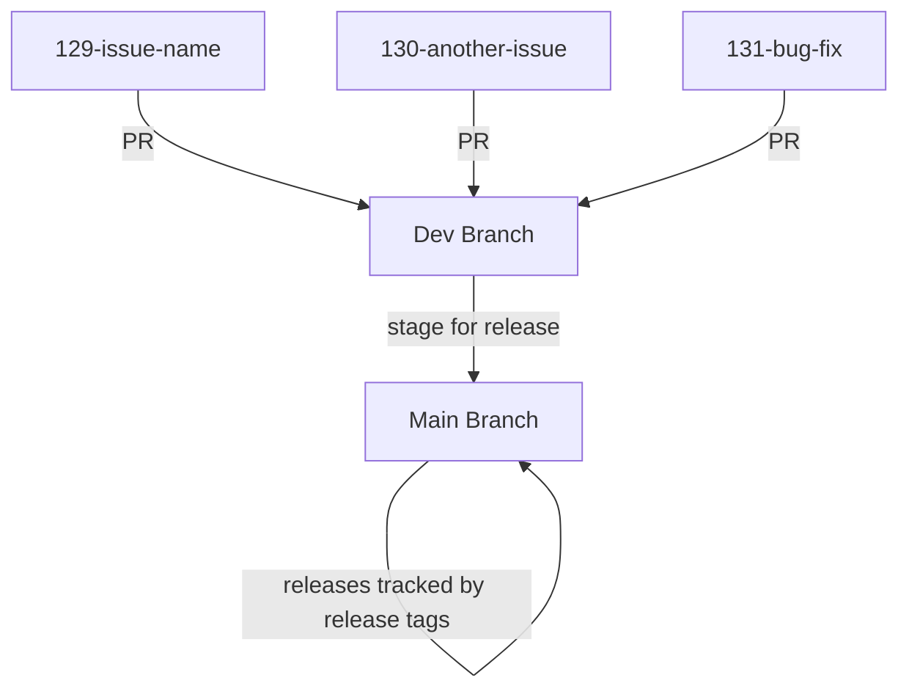
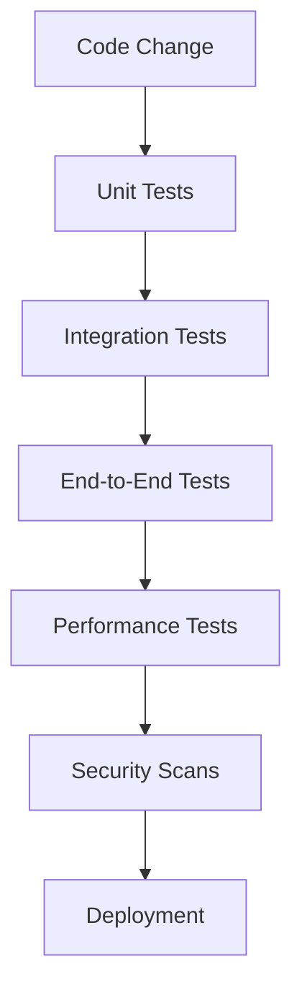
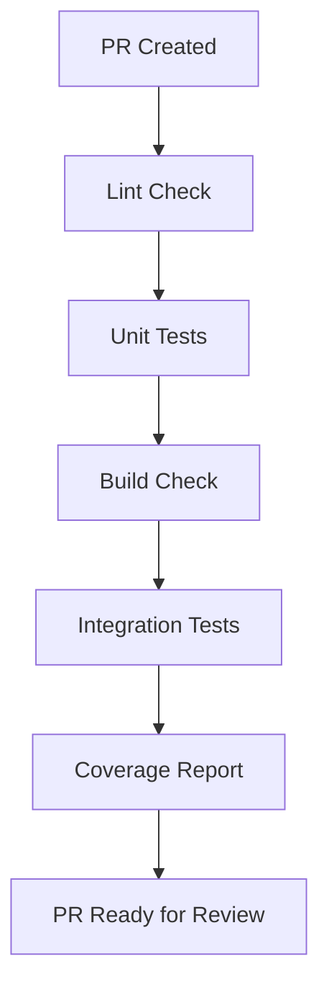
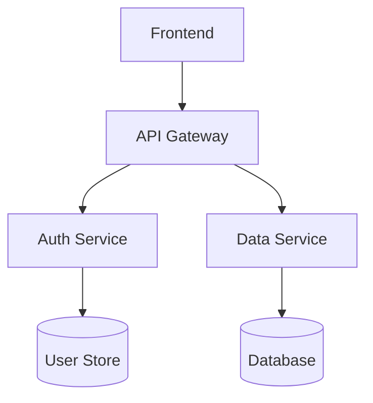
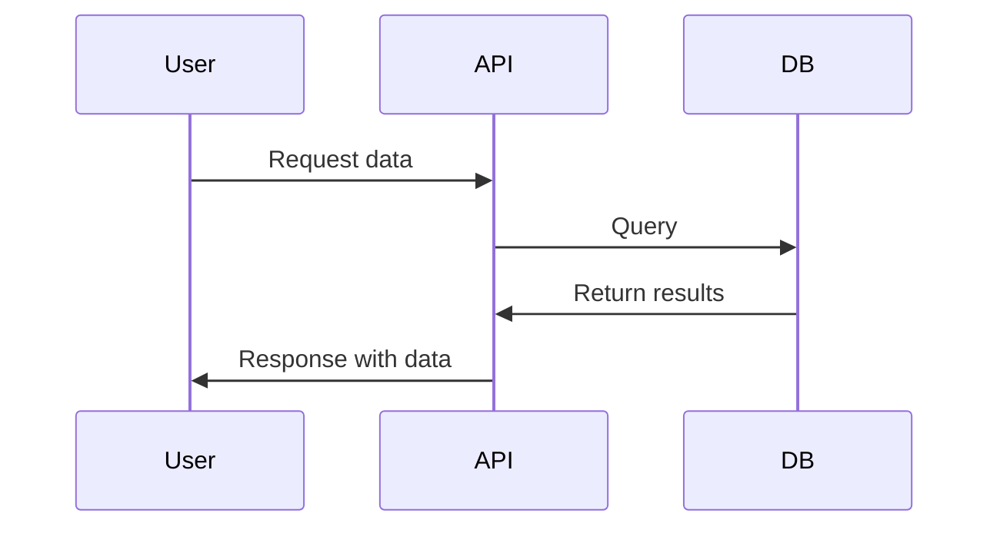
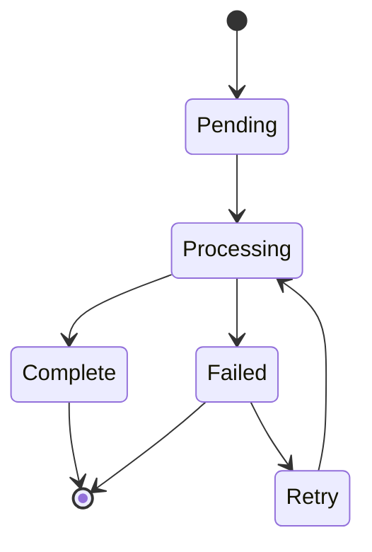

# Contributing to IPFS Kit Python

Thank you for your interest in contributing to IPFS Kit Python! This document provides guidelines and instructions for contributing to this project.

## Getting Started

### Prerequisites

- Python 3.8 or higher
- Git
- A GitHub account


# Coding Standards and workflows

## 1. Development Workflow

We follow a simplified workflow with main and dev branches, with issue-specific branches:



Always use the Issue template on Github when creating new issues and fill out all required fields.
Once an issue has been filed create a branch for it using the following conventions:

### Branch Naming Conventions

- Issue branches follow the pattern: `{issue-number}-{issue-name}`
- Example: `129-add-login-feature`
- All issue branches are created from the `dev` branch


### Pull Request Process

1. Create issue branch from `dev` branch using the format `{issue-number}-{issue-name}`
2. Implement changes
3. Write/update tests for any added functionality
4. Update relevant documentation
5. Create PR with description of changes that:
    - References the issue number
    - Explicitly mentions what documentation was updated or why no documentation update was needed
    - Describes what tests were added/updated
6. Reviewer verifies:
    - Code works as expected
    - Documentation is updated appropriately
    - Tests are written and pass for new functionality
7. Address any feedback from review
8. Merge into dev once approved

## 2. Coding Standards

### General Principles

- **Avoid Code Duplication**: Reuse code through functions, classes, and modules instead of copying and pasting. When similar code appears in multiple places, abstract it into a reusable component.
    
- **Prioritize Simplicity**: Choose straightforward solutions over complex ones. Simple code is easier to understand, maintain, and debug. Avoid over-engineering and unnecessary abstractions.
    
- **Implement Only What's Needed**: Don't add functionality based on speculation about future requirements. Wait until a feature is actually needed before implementing it to avoid wasted effort and unnecessary complexity.
    
- **Separation of Concerns**: Divide your program into distinct sections, each addressing a separate concern. For example, keep user interface code separate from business logic and data access. This improves maintainability and allows components to evolve independently.
    

### Code Style Guide

#### Formatting

- **Use consistent indentation**: Follow language conventions
    
- **Use descriptive names**: Variable and function names should clearly communicate their purpose and behavior. Prefer specific, descriptive terms over vague abbreviations.
    
    - Good: `getUserByEmail`, `total_invoice_amount`, `isEligibleForDiscount`
    - Poor: `getUsr`, `tmp`, `check`
- **Follow language-specific naming conventions**:
    
    - **Python**:
        
        - Use `snake_case` for variables, functions, and methods
        - Use `PascalCase` for class names
        - Use `UPPER_SNAKE_CASE` for constants
        
        ```python
        # Python example
        DEFAULT_TIMEOUT = 30  # constant
        
        class UserAccount:  # class name in PascalCase
            def __init__(self, user_id, email_address):  # parameters in snake_case
                self.user_id = user_id
                self.email_address = email_address
                
            def calculate_account_balance(self):  # method in snake_case
                total_balance = 0  # variable in snake_case
                return total_balance
        ```
        
    - **TypeScript/JavaScript**:
        
        - Use `camelCase` for variables, functions, and methods
        - Use `PascalCase` for classes and interfaces
        - Use `UPPER_SNAKE_CASE` for constants
        
        ```typescript
        // TypeScript example
        const MAX_RETRY_ATTEMPTS = 3;  // constant
        
        interface UserProfile {  // interface in PascalCase
          firstName: string;
          lastName: string;
        }
        
        class AuthenticationService {  // class in PascalCase
          private currentUser: UserProfile;  // property in camelCase
          
          public validateUserCredentials(email: string, password: string): boolean {  // method in camelCase
            const isValidUser = true;  // variable in camelCase
            return isValidUser;
          }
        }
        ```
        

#### Comments

Comments should be used thoughtfully and maintained as code evolves. We categorize comments into the following types:

1. **Documentation Comments**: Explain the "what" and "how" of code - used for functions, classes, and modules
    
    ```python
    def calculate_discount(price, discount_percentage):
        """
        Calculate the final price after applying a discount percentage.
        
        Args:
            price (float): The original price
            discount_percentage (float): Discount as a percentage (0-100)
            
        Returns:
            float: The price after discount
            
        Raises:
            ValueError: If discount_percentage is negative or greater than 100
        """
    ```
    
    ```typescript
    /**
     * Authenticates a user with the provided credentials
     * @param email User's email address
     * @param password User's password
     * @returns Promise resolving to user object if authentication successful
     * @throws AuthError if credentials are invalid
     */
    async function authenticateUser(email: string, password: string): Promise<User> {
      // Implementation
    }
    ```
    
2. **Decision Comments**: Explain the "why" behind code choices or implementations
    
    ```python
    # Using binary search instead of linear search here
    # because the data set is always sorted and very large
    def find_user_in_database(user_id, sorted_users):
        # Binary search implementation
    ```
    
    ```typescript
    // We're using a throttled API call (1 per second) 
    // to avoid hitting the rate limit on the payment gateway
    export function processPayments(payments: Payment[]): void {
      payments.forEach((payment, index) => {
        setTimeout(() => submitPayment(payment), index * 1000);
      });
    }
    ```
    
3. **Temporary/Action Comments**: Highlight issues or future work needed
    
    ```python
    # TODO: Refactor this to use the new authentication system
    # once it's deployed to production
    def login_user(username, password):
        # Current implementation
    ```
    
    ```typescript
    // FIXME: This calculation is incorrect for leap years
    // Issue #143 tracks this bug
    function getDaysInYear(year: number): number {
      return 365;
    }
    ```
    
    ```javascript
    // HACK: Temporary workaround for API inconsistency
    // Remove when API version 2.3 is released
    function normalizeUserData(data) {
      // Implementation with workaround
    }
    ```
    

**Best Practices for Comments:**

- Keep comments up to date when code changes
- Don't comment on obvious code; focus on explaining complex logic
- For Decision Comments, include context that future developers wouldn't easily know
- For TODO/FIXME comments, include issue numbers when applicable
- Use standardized prefixes for action items: TODO, FIXME, HACK, NOTE

#### Error Handling

- Never silently catch exceptions
- Log errors with appropriate context
- Return meaningful error messages

### Language-Specific Standards

#### JavaScript/TypeScript

- Prefer `const` over `let`, avoid `var`
- Use TypeScript interfaces for complex objects
- Use async/await over callbacks or Promise chains
- Follow ESLint configurations

#### Python

- Follow PEP 8 style guide
- Use type hints (PEP 484)
- Prefer list comprehensions for simple transformations
- Always Use virtual environments for dependency management

#### Setting Up the Development Environment

1. Fork the repository on GitHub
2. Clone your fork locally:
   ```bash
   git clone https://github.com/YOUR-USERNAME/ipfs_kit_py.git
   cd ipfs_kit_py
   ```

3. Set up a virtual environment:
   ```bash
   python -m venv .venv
   source .venv/bin/activate  # On Windows: .venv\Scripts\activate
   ```

4. Install the package in development mode with all development dependencies:
   ```bash
   pip install -e ".[dev,full]"
   ```

## 3. Testing Pipeline

### Testing Framework



### Test Categories

- **Unit Tests**: Test individual functions and methods
- **Integration Tests**: Test interactions between components
- **End-to-End Tests**: Test full user flows
- **Performance Tests**: Test system under load
- **Security Tests**: Test for vulnerabilities

### Test Coverage

- Minimum of 80% code coverage for critical paths
- All bug fixes must include regression tests
- Edge cases should be explicitly tested

**NOTE: This section needs to be improved later with more specific guidance on measuring coverage, dealing with legacy code, and strategies for improving coverage over time.**

### Continuous Integration

Our CI pipeline runs on every pull request and includes:



## 4. Quality Standards

### Code Review Checklist

- Does the code follow our style guide?
- Are there appropriate tests?
- Is the code efficient and performant?
- Is there any unnecessary complexity?
- Is the documentation updated?
- Are there security concerns?
If any of these are present address them with appropriate code comments or in the PR. 

### Security Standards

- Follow OWASP guidelines
- Sanitize all user inputs
- Use parameterized queries for database operations
- Keep dependencies up to date
- Regular security audits


## 5. Documentation Guidelines

### Code Documentation

- All public APIs should have clear documentation
- Complex algorithms should include explanations
- Update documentation with code changes

### User Documentation

- Installation and setup guides
- Feature documentation with examples
- Troubleshooting guides
- FAQs

### Documentation Format

- Use Markdown for all documentation
- Include diagrams where appropriate using Mermaid
- Keep documentation DRY - link instead of duplicating

### Example Mermaid Diagrams

**Component Interaction:**



**Sequence Diagram:**do you have a link 



**State Diagram:**


