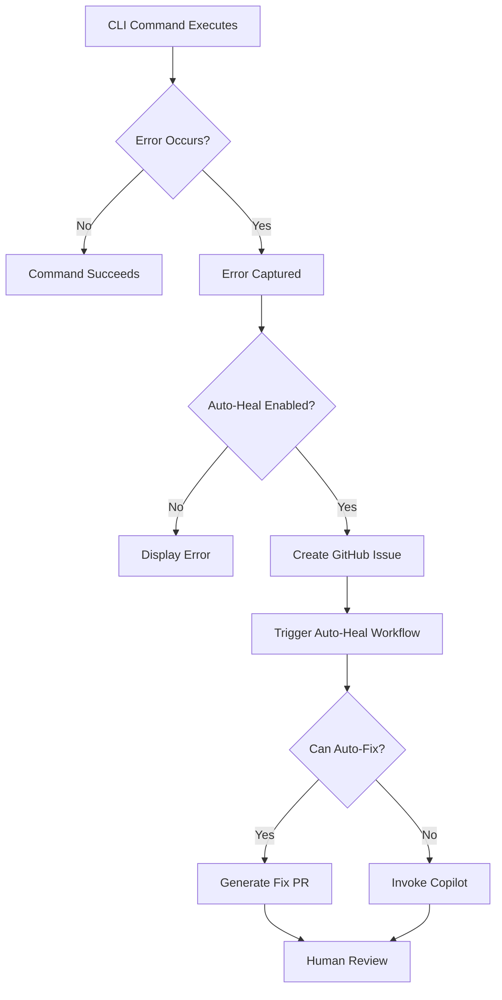

# Auto-Healing Feature for IPFS-Kit CLI

The IPFS-Kit CLI includes an automatic error-to-issue-to-PR auto-healing system that captures errors, creates GitHub issues, and automatically generates fixes using GitHub Copilot.

## Overview

When the `ipfs-kit` CLI encounters an error and auto-healing is enabled:

1. **Error Capture**: The error is captured with full context including:
   - Stack trace
   - Command executed
   - Arguments passed
   - Environment variables
   - Log context (last N log lines before the error)
   - Working directory
   - Python version

2. **GitHub Issue Creation**: A GitHub issue is automatically created with:
   - Formatted error information
   - Labels: `auto-heal`, `cli-error`, `automated-issue`
   - Complete diagnostic information

3. **Automatic Fix Generation**: The auto-heal workflow is triggered which:
   - Analyzes the error pattern
   - Generates fixes for known error types
   - Creates a draft pull request with the fix
   - Or invokes GitHub Copilot for complex errors

4. **GitHub Copilot Integration**: For complex errors:
   - GitHub Copilot is automatically invoked
   - AI-assisted code review and fix generation
   - Draft PR is created with suggested fixes

## Setup

### Prerequisites

- GitHub repository access
- GitHub personal access token with `repo` permissions
- Environment variables configured

### Configuration

#### Option 1: Environment Variables

Set the following environment variables:

```bash
export IPFS_KIT_AUTO_HEAL=true
export GITHUB_TOKEN=your_github_token_here
export GITHUB_REPOSITORY=owner/repo
```

#### Option 2: CLI Configuration

Enable auto-healing using the CLI:

```bash
# Enable auto-healing
ipfs-kit autoheal enable --github-token YOUR_TOKEN --github-repo owner/repo

# Check status
ipfs-kit autoheal status

# View configuration
ipfs-kit autoheal config

# Disable auto-healing
ipfs-kit autoheal disable
```

#### Option 3: Configuration File

Auto-healing configuration is stored in `~/.ipfs_kit/auto_heal_config.json`:

```json
{
  "enabled": true,
  "github_repo": "owner/repo",
  "max_log_lines": 100,
  "include_stack_trace": true,
  "auto_create_issues": true,
  "issue_labels": [
    "auto-heal",
    "cli-error",
    "automated-issue"
  ]
}
```

**Note**: The GitHub token is read from environment variables and not stored in the configuration file for security.

## Usage

### Automatic Error Capture

Once configured, auto-healing works automatically. When any CLI command fails:

```bash
$ ipfs-kit mcp start --port 8004
Error: Connection refused...

⚠️  An error occurred and has been automatically reported.
📋 Issue created: https://github.com/owner/repo/issues/123
🤖 The auto-healing system will attempt to fix this error.
```

### Manual Configuration

#### View Current Status

```bash
ipfs-kit autoheal status
```

Output:
```
Auto-Healing Status:
  Enabled: Yes
  Configured: Yes
  Repository: owner/repo
  GitHub Token: Set
  Auto-create issues: Yes
  Max log lines: 100
  Issue labels: auto-heal, cli-error, automated-issue
```

#### View Status as JSON

```bash
ipfs-kit autoheal status --json
```

#### Modify Configuration

```bash
# Set max log lines
ipfs-kit autoheal config --set max_log_lines 200

# Set issue labels
ipfs-kit autoheal config --set issue_labels "auto-heal,bug,automated"

# Get specific config value
ipfs-kit autoheal config --get max_log_lines
```

## How It Works

### Error Detection Flow



### Auto-Heal Workflow

The auto-heal workflow (`.github/workflows/auto-heal-workflow.yml`) is triggered when:

1. A GitHub issue is created with labels `auto-heal` and `cli-error`
2. The workflow analyzes the error from the issue body
3. Attempts to generate a fix using pattern matching
4. If successful, creates a PR with the fix
5. If unsuccessful, invokes GitHub Copilot for assistance

### Error Pattern Recognition

The system recognizes and can auto-fix several error patterns:

- **Missing Dependencies**: `ModuleNotFoundError`, `ImportError`
- **Missing Files**: `FileNotFoundError`
- **Permission Errors**: `PermissionError`
- **Connection Errors**: `ConnectionError`, `ConnectionRefusedError`

For other error types, GitHub Copilot is invoked for AI-assisted resolution.

## Configuration Options

| Option | Type | Default | Description |
|--------|------|---------|-------------|
| `enabled` | boolean | `false` | Enable/disable auto-healing |
| `github_token` | string | from env | GitHub personal access token |
| `github_repo` | string | from env | Repository in `owner/repo` format |
| `max_log_lines` | integer | `100` | Number of log lines to include |
| `include_stack_trace` | boolean | `true` | Include stack trace in issues |
| `auto_create_issues` | boolean | `true` | Automatically create issues |
| `issue_labels` | array | See below | Labels applied to issues |

### Default Issue Labels

- `auto-heal` - Triggers the auto-heal workflow
- `cli-error` - Identifies CLI-specific errors
- `automated-issue` - Marks as automatically created

## Security Considerations

### GitHub Token

- **Never commit** your GitHub token to the repository
- Store in environment variables or secure secret management
- Token requires `repo` permissions for issue/PR creation
- Token is **not** saved in configuration files

### Privacy

- Error reports may contain sensitive information
- Review captured environment variables
- Consider filtering sensitive data from logs
- Issues are created in your repository (not public by default)

## Troubleshooting

### Auto-healing not working

1. Check configuration:
   ```bash
   ipfs-kit autoheal status
   ```

2. Verify environment variables:
   ```bash
   echo $IPFS_KIT_AUTO_HEAL
   echo $GITHUB_TOKEN
   echo $GITHUB_REPOSITORY
   ```

3. Check permissions:
   - GitHub token must have `repo` scope
   - Token must have access to the repository

### Issues not being created

1. Verify token permissions
2. Check repository name format (`owner/repo`)
3. Review error logs for API failures
4. Test GitHub API connectivity

### Workflow not triggering

1. Verify workflow file exists: `.github/workflows/auto-heal-workflow.yml`
2. Check issue has correct labels: `auto-heal` and `cli-error`
3. Verify GitHub Actions are enabled for the repository

## Examples

### Example 1: Missing Dependency Error

```bash
$ ipfs-kit mcp start
ModuleNotFoundError: No module named 'flask'

⚠️  An error occurred and has been automatically reported.
📋 Issue created: https://github.com/owner/repo/issues/42
🤖 The auto-healing system will attempt to fix this error.
```

**Result**: Auto-heal workflow creates a PR adding `flask` to dependencies.

### Example 2: Connection Error

```bash
$ ipfs-kit daemon start
ConnectionRefusedError: [Errno 111] Connection refused

⚠️  An error occurred and has been automatically reported.
📋 Issue created: https://github.com/owner/repo/issues/43
🤖 The auto-healing system will attempt to fix this error.
```

**Result**: Auto-heal workflow invokes Copilot to add connection retry logic.

## Advanced Usage

### Customize Issue Labels

```bash
ipfs-kit autoheal config --set issue_labels "auto-heal,bug,high-priority"
```

### Adjust Log Context

```bash
# Capture more log lines for complex errors
ipfs-kit autoheal config --set max_log_lines 200

# Reduce log lines for privacy
ipfs-kit autoheal config --set max_log_lines 50
```

### Temporary Disable

```bash
# Disable without losing configuration
ipfs-kit autoheal disable

# Re-enable later
ipfs-kit autoheal enable
```

## API Reference

### AutoHealConfig

Configuration class for auto-healing feature.

```python
from ipfs_kit_py.auto_heal.config import AutoHealConfig

config = AutoHealConfig(
    enabled=True,
    github_token="token",
    github_repo="owner/repo",
    max_log_lines=100
)

# Check if properly configured
if config.is_configured():
    # Save configuration
    config.save_to_file()
```

### ErrorCapture

Capture errors with full context.

```python
from ipfs_kit_py.auto_heal.error_capture import ErrorCapture

error_capture = ErrorCapture(max_log_lines=100)

try:
    # Your code here
    pass
except Exception as e:
    captured = error_capture.capture_error(
        e,
        command="ipfs-kit test",
        arguments={"arg": "value"}
    )
    
    # Format for GitHub issue
    issue_body = captured.format_for_issue()
```

### GitHubIssueCreator

Create GitHub issues from captured errors.

```python
from ipfs_kit_py.auto_heal.github_issue_creator import GitHubIssueCreator
from ipfs_kit_py.auto_heal.config import AutoHealConfig

config = AutoHealConfig.from_file()
creator = GitHubIssueCreator(config)

# Create issue from captured error
issue_url = creator.create_issue_from_error(captured_error)
```

## Contributing

To improve the auto-healing system:

1. Add new error patterns to `scripts/ci/generate_cli_error_fix.py`
2. Improve fix generation logic
3. Add tests to `tests/test_auto_heal.py`
4. Update documentation

## License

Same as IPFS-Kit (AGPL-3.0-or-later)
